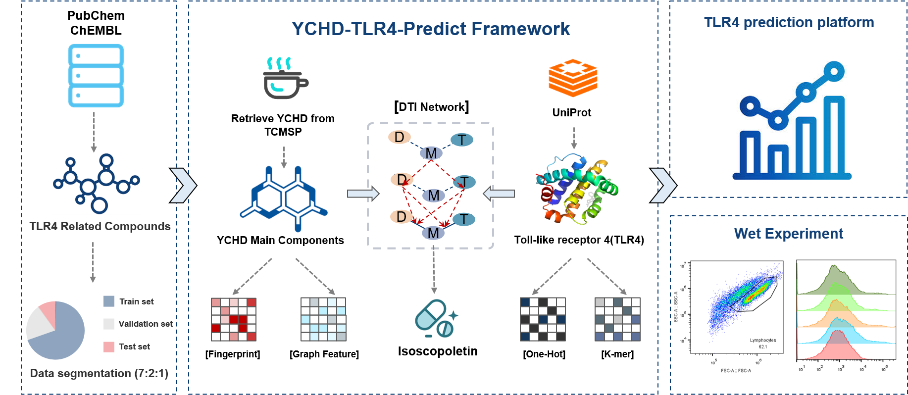

# YCHD-TLR4-Predict Platform
Discovery of the active ingredient of Yinchenhao Decoction targeting TLR4 for hepatic inflammatory diseases based on deep learning approach

### Architecture   

# Usage
## 1. How to use it?
you need to open use.py. We have debugged all the settings.We have debugged all the settings and can train them directly by running them
 

## 2. How to test the models. 
After the training is completed, the program will automatically save the weight file and call it.

